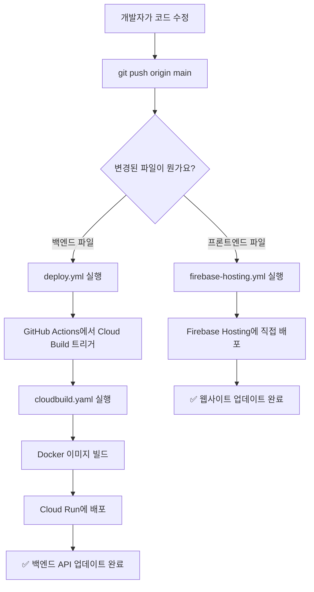

# GraphRAG 프로젝트 CI/CD 완전 가이드

이 문서는 CI/CD(Continuous Integration/Continuous Deployment)를 처음 접하는 개발자를 위해 작성되었습니다. GraphRAG 프로젝트의 자동 배포 시스템이 어떻게 작동하는지 단계별로 설명합니다.

## 📖 목차

1. [CI/CD가 무엇인가요?](#cicd가-무엇인가요)
2. [전체 배포 흐름 개요](#전체-배포-흐름-개요)
3. [파일별 상세 설명](#파일별-상세-설명)
4. [실제 배포 시나리오](#실제-배포-시나리오)
5. [문제 해결 가이드](#문제-해결-가이드)

---

## CI/CD가 무엇인가요?

### CI (Continuous Integration) - 지속적 통합
코드를 저장소(GitHub)에 올릴 때마다 자동으로:
- 코드가 올바르게 작동하는지 테스트
- 다른 개발자의 코드와 충돌이 없는지 확인
- 애플리케이션을 빌드(패키지화)

### CD (Continuous Deployment) - 지속적 배포
테스트가 성공하면 자동으로:
- 애플리케이션을 실제 서버에 배포
- 사용자가 바로 사용할 수 있게 만듦
- 배포 과정에서 문제가 생기면 자동으로 롤백

### 왜 필요한가요?
**수동 배포의 문제점:**
```
개발자가 직접 해야 할 일들:
1. 코드 테스트
2. Docker 이미지 빌드
3. Google Cloud에 업로드
4. Cloud Run 서비스 배포
5. Firebase에 웹사이트 업로드
6. 문제 발생 시 수동 롤백
```

**자동 배포의 장점:**
```
git push만 하면:
1. ✅ 자동으로 모든 테스트 실행
2. ✅ 자동으로 빌드 및 배포
3. ✅ 문제 시 자동 알림
4. ✅ 배포 기록 추적 가능
```

---

## 전체 배포 흐름 개요



### 주요 구성요소

| 파일 | 역할 | 실행 위치 | 언제 실행되나요? |
|------|------|-----------|-----------------|
| **deploy.yml** | 백엔드 API 배포 관리 | GitHub Actions | 백엔드 코드 변경 시 |
| **firebase-hosting.yml** | 웹사이트 배포 관리 | GitHub Actions | 프론트엔드 코드 변경 시 |
| **cloudbuild.yaml** | Docker 이미지 빌드 및 Cloud Run 배포 | Google Cloud Build | deploy.yml에서 호출 시 |

---

## 파일별 상세 설명

### 1. 📄 `.github/workflows/deploy.yml` - 백엔드 API 배포 관리

이 파일은 **GitHub Actions**에서 실행되며, 백엔드 API를 Google Cloud Run에 배포하는 역할을 합니다.

#### 🔍 작동 방식

**언제 실행되나요?**
```yaml
on:
  push:
    branches: [main, develop]
    paths:
      - 'main.py'           # FastAPI 메인 파일
      - 'modules/**'        # 백엔드 로직 파일들
      - 'requirements.txt'  # Python 패키지 의존성
      - 'Dockerfile'        # Docker 설정
```
→ 이런 파일들이 변경되어 main 또는 develop 브랜치에 푸시되면 자동 실행

**실행 단계:**
1. **코드 다운로드**: GitHub에서 최신 코드를 가져옴
2. **Google Cloud 인증**: 서비스 계정 키를 사용해 로그인
3. **Cloud Build 트리거**: `cloudbuild.yaml`을 실행하도록 Google Cloud Build에 요청
4. **배포 결과 알림**: 성공/실패 여부를 GitHub에 표시

#### 💡 핵심 개념

**GitHub Actions란?**
- GitHub에서 제공하는 무료 CI/CD 서비스
- `.github/workflows/` 폴더의 YAML 파일을 읽어서 자동 실행
- 가상 컴퓨터(Ubuntu)를 임시로 제공해서 명령어들을 실행

**인증 방식:**
```yaml
# GitHub Secrets에 저장된 서비스 계정 키 사용
- name: Authenticate to Google Cloud
  uses: google-github-actions/auth@v2
  with:
    credentials_json: ${{ secrets.GCP_SA_KEY }}
```

### 2. 📄 `.github/workflows/firebase-hosting.yml` - 웹사이트 배포 관리

이 파일은 **GitHub Actions**에서 실행되며, 프론트엔드 웹사이트를 Firebase Hosting에 배포하는 역할을 합니다.

#### 🔍 작동 방식

**언제 실행되나요?**
```yaml
on:
  push:
    branches: [main, develop]
    paths:
      - 'public/**'        # 웹사이트 파일들 (HTML, CSS, JS)
      - 'firebase.json'    # Firebase 설정
```
→ 웹사이트 관련 파일이 변경되면 자동 실행

**특별한 기능 - PR 미리보기:**
```yaml
on:
  pull_request:
    branches: [main, develop]
```
→ Pull Request를 만들면 임시 미리보기 웹사이트를 자동으로 생성해줌

**실행 단계:**
1. **웹사이트 파일 검증**: HTML, CSS, JS 파일들이 올바른지 확인
2. **Firebase 배포**: `public/` 폴더의 파일들을 Firebase Hosting에 업로드
3. **URL 알림**: 배포된 웹사이트 주소를 GitHub에 표시

#### 💡 핵심 개념

**Firebase Hosting이란?**
- Google의 무료 웹사이트 호스팅 서비스
- HTML, CSS, JavaScript 파일을 업로드하면 즉시 웹사이트가 됨
- CDN을 통해 전 세계 어디서나 빠르게 접속 가능

**브랜치별 배포 환경:**
- `main` 브랜치 → **프로덕션** (실제 사용자용)
- `develop` 브랜치 → **스테이징** (테스트용)

### 3. 📄 `cloudbuild.yaml` - Docker 이미지 빌드 및 배포 실행

이 파일은 **Google Cloud Build**에서 실행되며, 실제로 백엔드 애플리케이션을 빌드하고 배포하는 작업을 수행합니다.

#### 🔍 작동 방식

이 파일은 여러 단계로 구성된 **파이프라인**입니다:

**1단계: Docker 이미지 빌드**
```yaml
- name: 'gcr.io/cloud-builders/docker'
  args: ['build', '-t', 'your-image-name', '.']
```
→ `Dockerfile`을 읽어서 Python 애플리케이션을 Docker 컨테이너로 패키지화

**2단계: 이미지 저장**
```yaml
- name: 'gcr.io/cloud-builders/docker'
  args: ['push', 'your-image-name']
```
→ 생성된 Docker 이미지를 Google Artifact Registry에 업로드

**3단계: 블루-그린 배포**
```yaml
- name: 'gcr.io/google.com/cloudsdktool/cloud-sdk'
  args: ['gcloud', 'run', 'deploy', 'green-service', ...]
```
→ 새 버전을 별도 서비스로 배포 (무중단 배포)

**4단계: 헬스체크**
```yaml
- name: 'gcr.io/cloud-builders/curl'
  args: ['curl', '-f', 'https://green-service-url/api/health']
```
→ 새 버전이 제대로 작동하는지 확인

**5단계: 트래픽 전환**
```yaml
- name: 'gcr.io/google.com/cloudsdktool/cloud-sdk'
  args: ['gcloud', 'run', 'services', 'update-traffic', ...]
```
→ 문제없으면 실제 사용자 트래픽을 새 버전으로 전환

#### 💡 핵심 개념

**Docker란?**
- 애플리케이션을 "컨테이너"라는 격리된 환경에 패키지화하는 기술
- 개발 환경과 배포 환경이 달라서 생기는 문제를 해결

**블루-그린 배포란?**
```
[기존 서비스 (Blue)]  ←── 사용자 트래픽 (100%)
[새 서비스 (Green)]   ←── 트래픽 없음 (0%)

↓ 새 버전 테스트 완료 후

[기존 서비스 (Blue)]  ←── 트래픽 없음 (0%) → 삭제
[새 서비스 (Green)]   ←── 사용자 트래픽 (100%)
```
→ 서비스 중단 없이 새 버전으로 업데이트 가능

**환경변수 설정:**
```yaml
--set-env-vars="PROJECT_ID=${_PROJECT_ID},DISCOVERY_ENGINE_ID=${_DISCOVERY_ENGINE_ID}"
```
→ 배포되는 애플리케이션이 사용할 설정값들을 전달

---

## 실제 배포 시나리오

### 시나리오 1: 백엔드 API 수정 후 배포

**1. 개발자가 코드 수정**
```bash
# modules/services/discovery_engine_api.py 파일 수정
git add modules/services/discovery_engine_api.py
git commit -m "검색 알고리즘 성능 개선"
git push origin main
```

**2. GitHub Actions 자동 실행**
- GitHub이 `deploy.yml` 파일을 감지
- Ubuntu 가상머신이 자동으로 생성됨
- Google Cloud에 인증 후 Cloud Build 실행

**3. Cloud Build 파이프라인 실행**
```
[15:30:01] 🚀 Docker 이미지 빌드 시작...
[15:31:15] ✅ 이미지 빌드 완료
[15:31:16] 🚀 Artifact Registry에 푸시...
[15:32:30] ✅ 이미지 푸시 완료
[15:32:31] 🚀 Green 서비스 배포 시작...
[15:34:45] ✅ Green 서비스 배포 완료
[15:34:46] 🔍 헬스체크 실행...
[15:35:00] ✅ 헬스체크 통과
[15:35:01] 🔄 트래픽 전환 시작...
[15:35:30] ✅ 배포 완료!
```

**4. 결과 확인**
- GitHub Actions 탭에서 배포 상태 확인 가능
- Cloud Run 콘솔에서 새 버전 확인 가능
- API 엔드포인트가 새 코드로 업데이트됨

### 시나리오 2: 프론트엔드 웹사이트 수정 후 배포

**1. 개발자가 웹사이트 수정**
```bash
# public/index.html 파일 수정
git add public/index.html
git commit -m "메인 페이지 UI 개선"
git push origin main
```

**2. Firebase Hosting 배포**
```
[15:30:01] 🚀 웹사이트 파일 검증...
[15:30:15] ✅ HTML, CSS, JS 파일 검증 완료
[15:30:16] 🚀 Firebase Hosting에 업로드...
[15:30:45] ✅ 배포 완료!
[15:30:46] 🌐 웹사이트 URL: https://your-project.web.app
```

### 시나리오 3: Pull Request로 미리보기 생성

**1. 개발자가 새 브랜치에서 작업**
```bash
git checkout -b feature/new-ui
# 파일 수정 후
git push origin feature/new-ui
```

**2. GitHub에서 Pull Request 생성**
- GitHub 웹사이트에서 "Create Pull Request" 클릭

**3. 자동 미리보기 배포**
```
[15:30:01] 🚀 PR 미리보기 배포 시작...
[15:30:30] ✅ 미리보기 배포 완료!
[15:30:31] 🔗 미리보기 URL: https://your-project--pr123-feature-abc.web.app
```

**4. 팀 리뷰 및 머지**
- 팀원들이 미리보기 URL에서 변경사항 확인
- 문제없으면 Pull Request 승인 후 merge
- merge되면 자동으로 프로덕션 배포 실행

---

## 문제 해결 가이드

### 자주 발생하는 문제들

#### 1. 🔴 "인증 실패" 오류
**증상:**
```
Error: Failed to authenticate with Google Cloud
```

**원인:**
- GitHub Secrets의 서비스 계정 키가 올바르지 않음
- 키 파일의 권한이 부족함

**해결방법:**
```bash
# 1. 새 서비스 계정 키 생성
python setup.py

# 2. 생성된 키 파일을 GitHub Secrets에 등록
# GitHub 저장소 → Settings → Secrets and Variables → Actions
# Name: GCP_SA_KEY 또는 FIREBASE_SA_KEY
# Value: 키 파일의 전체 내용 복사-붙여넣기
```

#### 2. 🔴 "Docker 빌드 실패" 오류
**증상:**
```
Error: failed to solve with frontend dockerfile.v0
```

**원인:**
- `Dockerfile`에 문법 오류가 있음
- 필요한 파일이 `.dockerignore`에 포함되어 제외됨

**해결방법:**
```bash
# 로컬에서 Docker 빌드 테스트
docker build -t test-image .

# 문제가 있으면 Dockerfile 수정 후 다시 푸시
git add Dockerfile
git commit -m "Dockerfile 수정"
git push origin main
```

#### 3. 🔴 "헬스체크 실패" 오류
**증상:**
```
Health check failed: HTTP 500 Internal Server Error
```

**원인:**
- 애플리케이션 코드에 런타임 오류가 있음
- 환경변수가 올바르게 설정되지 않음

**해결방법:**
```bash
# 1. Cloud Run 로그 확인
gcloud logging read "resource.type=cloud_run_revision AND resource.labels.service_name=your-service"

# 2. 로컬에서 테스트
uvicorn main:app --reload --port 8000
curl http://localhost:8000/api/health

# 3. 문제 수정 후 다시 배포
git add .
git commit -m "헬스체크 오류 수정"
git push origin main
```

#### 4. 🔴 "Firebase 배포 실패" 오류
**증상:**
```
Error: HTTP Error: 403, The caller does not have permission
```

**원인:**
- Firebase 서비스 계정의 권한이 부족함
- `firebase.json` 설정이 잘못됨

**해결방법:**
```bash
# 1. Firebase 프로젝트 설정 확인
firebase projects:list

# 2. .firebaserc 파일 확인
cat .firebaserc

# 3. 권한 문제면 서비스 계정 재생성
python setup.py --firebase-only
```

### 배포 상태 모니터링 방법

#### GitHub Actions에서 확인
1. GitHub 저장소 → "Actions" 탭
2. 최근 워크플로우 실행 상태 확인
3. 실패한 단계 클릭해서 상세 로그 확인

#### Google Cloud Console에서 확인
1. **Cloud Build**: 빌드 기록 및 로그
2. **Cloud Run**: 서비스 상태 및 트래픽
3. **Firebase Hosting**: 배포 기록 및 도메인 설정

#### 유용한 모니터링 명령어
```bash
# Cloud Run 서비스 상태 확인
gcloud run services list --region=asia-northeast3

# 최근 배포 기록 확인
gcloud run revisions list --service=your-service --region=asia-northeast3

# Firebase 배포 상태 확인
firebase hosting:sites:list
```

---

## 💡 핵심 요약

### CI/CD의 3단계 흐름
1. **개발자가 코드를 푸시** → GitHub 저장소에 업로드
2. **GitHub Actions가 자동 실행** → 테스트, 빌드, 배포 과정 자동화
3. **사용자가 즉시 사용 가능** → 웹사이트와 API가 최신 버전으로 업데이트

### 각 파일의 역할
- **`deploy.yml`**: "백엔드 API를 자동으로 배포해줘"
- **`firebase-hosting.yml`**: "웹사이트를 자동으로 배포해줘"
- **`cloudbuild.yaml`**: "Docker로 패키지화하고 Cloud Run에 무중단 배포해줘"

### 장점
- ✅ **실수 방지**: 수동 배포에서 생기는 실수 없음
- ✅ **빠른 배포**: git push 한 번으로 5분 내 배포 완료
- ✅ **무중단 서비스**: 블루-그린 배포로 서비스 중단 없음
- ✅ **협업 효율**: PR 미리보기로 팀 리뷰 쉬움
- ✅ **추적 가능**: 모든 배포 기록이 자동 저장

이제 CI/CD가 어떻게 작동하는지 이해했으니, 안심하고 코드를 수정하고 푸시하세요! 
나머지는 자동화된 시스템이 알아서 처리해줄 것입니다. 🚀